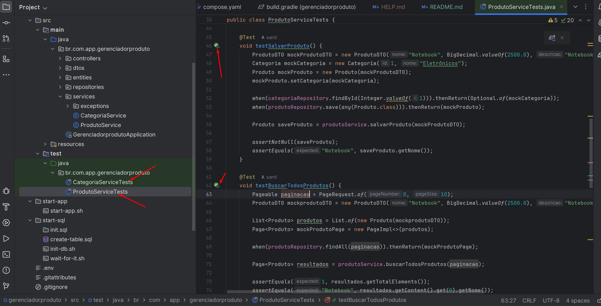

# Gerenciador de Produtos API

Este é um projeto desenvolvido em **Spring Boot** para gerenciar produtos e categorias.
Abaixo estão as instruções sobre como rodar o projeto, configurar o ambiente, rodar os testes e consumir os principais endpoints da API.


## Tecnologias Utilizadas
- **Java 17**
- **Spring Boot 3**
- **Spring Data JPA**
- **SQL Server**
- **Lombok**
- **JUnit 5 & Mockito**
- **Docker**
- **Gradle**
- **Shell Script**

## Configuração do Projeto
### Pré-requisitos
- Java 17 instalado
- Docker
- Gradle instalado

## Como Rodar o Projeto
1. Clone o repositório:
   ```sh
   git clone https://github.com/seu-usuario/gerenciador-produtos.git
   ```
2. Entre no diretório do projeto:
   ```sh
   cd gerenciador-produtos
   ```
3. Execute o Build e Deploy Automatizado com Gradle:
- O projeto inclui uma automatização do build e deploy que pode ser executada com um único comando:
   ```sh
   ./gradlew deploy
   ```
- Esse comando fará o seguinte:

- Construirá o projeto e gerará o arquivo JAR.

- Construirá a imagem Docker da aplicação.

- Iniciará os contêineres usando Docker Compose.
- 
4. Após aguardar o deploy a API estará acessível em http://localhost:8080.

5. Monitora o log da aplicação
     ```sh
      docker logs -f spring-app
    ```

6. Para parar e remover os containers, use:
    ```sh
   docker-compose down
   ```
   
###

# Desenvolvimento Local. Sem Utilização de Docker Multi-Stage Build com Docker Compose.
### Se você preferir desenvolver localmente sem Docker Compose, siga os passos abaixo para configurar o ambiente e executar a aplicação.

## 📌 Pré-requisitos

Antes de iniciar, certifique-se de ter os seguintes itens instalados:

- **Java JDK 17**: [Download do JDK 17](https://adoptopenjdk.net/)
- **Gradle**: [Guia de instalação do Gradle](https://gradle.org/install/)
- **SQL Server**: Instale o SQL Server localmente ou utilize um contêiner Docker.

## 🛠️ Configuração do Banco de Dados

### 🐘 Subindo o SQL Server Localmente

Caso não tenha o SQL Server instalado, você pode rodar o seguinte comando para criar um contêiner com o banco de dados:

```bash
docker run -e "ACCEPT_EULA=Y" -e "SA_PASSWORD=senha@12345" -p 1433:1433 --name sqlserver -d mcr.microsoft.com/mssql/server:2017-latest
```

### 📂 Criando o Banco de Dados

Conecte-se ao SQL Server utilizando o SQL Server Management Studio (SSMS) ou DBEAVER e execute o seguinte script SQL:

```sql
IF NOT EXISTS (SELECT * FROM SYS.DATABASES WHERE name = 'PRODUTODB')
BEGIN
    CREATE DATABASE PRODUTODB;
END
GO
```

### 🖥️ Configuração sem Docker

Se preferir desenvolver localmente sem Docker, siga os passos abaixo:

1. **Instale o SQL Server localmente**: Você pode baixar o [SQL Server Express](https://www.microsoft.com/pt-br/sql-server/sql-server-downloads).
2. **Configure o SQL Server**: Após a instalação, configure o SQL Server para aceitar conexões locais.
3. **Criar o Banco de Dados**: Utilize o script SQL acima para criar o banco `PRODUTODB`.
4. **Verifique a conexão**: Certifique-se de que o SQL Server está rodando e acessível na porta `1433`.

## ⚙️ Configuração da Aplicação

arquivo `application.properties` com a configuração para conexão com o banco de dados:

```properties
spring.application.name=gerenciadorproduto

# Configurações do SQL Server
spring.datasource.url=jdbc:sqlserver://localhost:1433;databaseName=PRODUTODB;encrypt=false
spring.datasource.username=sa
spring.datasource.password=senha@12345

# Configurações do Hikari (pool de conexões)
spring.datasource.hikari.connection-timeout=30000
spring.datasource.hikari.max-lifetime=600000
spring.datasource.hikari.idle-timeout=300000

# Configurações do JPA/Hibernate
spring.jpa.database-platform=org.hibernate.dialect.SQLServerDialect
spring.jpa.hibernate.ddl-auto=update
```

## 🚀 Executando a Aplicação

Com o banco de dados configurado, execute a aplicação com o seguinte comando:

```bash
./gradlew bootRun
```

A aplicação estará disponível em:

```
http://localhost:8080
```

## 📜 Logs da Aplicação

Os logs serão exibidos no terminal durante a execução. Caso tenha sido configurado, também poderão ser encontrados no arquivo `logs/application.log`.

## 🔧 Dicas Adicionais

- **Criação Automática de Tabelas**: O Hibernate criará automaticamente as tabelas no banco de dados caso `spring.jpa.hibernate.ddl-auto=update` esteja ativado.
- **Reset do Banco de Dados**: Para reiniciar o banco, execute:

  ```sql
  DROP DATABASE PRODUTODB;
  CREATE DATABASE PRODUTODB;
  ```

## 📌 Resumo ambiente de docker-compose mult-stages

1. Suba o SQL Server localmente (ou use Docker).
2. Execute o script de criação do banco de dados `PRODUTODB`.
3. Configure o `application.properties` com as credenciais do banco.
4. Execute a aplicação com `./gradlew bootRun`.

---


## Endpoints da API
### Categoria Controller
- **Criar Categoria**
  ```http
  POST /categorias
  ```
  Body:
  ```json
  {
    "nome": "Eletrônicos"
  }
  ```
- **Buscar todas as categorias**
  ```http
  GET /categorias
  ```
- **Buscar categoria por ID**
  ```http
  GET /categorias/{id}
  ```
- **Atualizar Categoria**
  ```http
  PUT /categorias/{id}
  ```
  Body:
  ```json
  {
    "nome": "Nova Categoria"
  }
  ```
- **Deletar Categoria**
  ```http
  DELETE /categorias/{id}
  ```

**Filtrar Categorias por Nome**
    ```http
    GET /categorias/filtrar
    ```
Parâmetros:
- `nome` (String) - Nome da categoria a ser filtrada.
- `page` (Integer) - Número da página.
- `size` (Integer) - Quantidade de itens por página.

  **Resposta de Sucesso (200 OK)**:
  ```json
  {
    "content": [
      {
        "id": 1,
        "nome": "Eletrônicos"
      }
    ],
    "totalPages": 1,
    "totalElements": 1
  }
  ```

### Produto Controller
- **Criar Produto**
  ```http
  POST /produtos
  ```
  Body:
  ```json
  {
    "nome": "Notebook",
    "descricao": "Notebook Gamer",
    "preco": 2500.0,
    "quantidade": 10,
    "categoriaId": 1
  }
  ```
- **Buscar todos os produtos**
  ```http
  GET /produtos
  ```
- **Buscar produto por ID**
  ```http
  GET /produtos/{id}
  ```
- **Atualizar Produto**
  ```http
  PUT /produtos/{id}
  ```
  Body:
  ```json
  {
    "nome": "Notebook Atualizado",
    "descricao": "Novo Modelo",
    "preco": 3000.0,
    "quantidade": 5,
    "categoriaId": 1
  }
  ```
- **Deletar Produto**
  ```http
  DELETE /produtos/{id}
  ```

  **Filtrar Produtos por Quantidade**
  ```http
  GET /produtos/filtrar
  ```
  Parâmetros:
  - `quantidade` (Integer) - Quantidade mínima do produto a ser filtrado.
    - `page` (Integer) - Número da página.
    - `size` (Integer) - Quantidade de itens por página.
  
    **Resposta de Sucesso (200 OK)**:
    ```json
    {
      "content": [
        {
          "id": 1,
          "nome": "Notebook",
          "descricao": "Notebook Gamer",
          "preco": 2500.0,
          "quantidade": 10,
          "categoriaId": 1
        }
      ],
      "totalPages": 1,
      "totalElements": 1
    }
    ```

  **Pesquisa de Produtos com Filtros**
  - **Pesquisar Produtos**
    ```http
    GET /produtos/filtros
    ```
    Parâmetros de Consulta (Query Params):
    - `nome` (opcional): Nome do produto.
    - `precoMin` (opcional): Preço mínimo do produto.
    - `precoMax` (opcional): Preço máximo do produto.
    - `descricao` (opcional): Descrição do produto.
    - `quantidadeMin` (opcional): Quantidade mínima em estoque.
    - `quantidadeMax` (opcional): Quantidade máxima em estoque.
    - `categoria` (opcional): ID da categoria do produto.
  
    **Exemplo de Requisição:**
    ```http
    GET /produtos/filtros?nome=Celular&precoMin=1000&precoMax=5000
    ```
  
    **Resposta Exemplo:**
    ```json
    [
      {
        "id": 1,
        "nome": "Celular",
        "descricao": "Celular Smartphone",
        "preco": 2500.00,
        "quantidade": 15,
        "categoria": {
          "id": 2,
          "nome": "Eletrônicos"
        }
      }
    ]
    ```
    


## Testes
O projeto contém testes unitários para os services de Categoria e Produto, utilizando **JUnit 5 e Mockito**.

### Rodando os Testes
Execute os testes com:
```sh
    ./gradlew test
```
Ou poderá executa Um por Um, atraves do icone de run da IDE.


Os testes cobrem os seguintes cenários:
- Criação de categorias e produtos
- Busca de registros no banco
- Atualização de dados
- Remoção de registros

